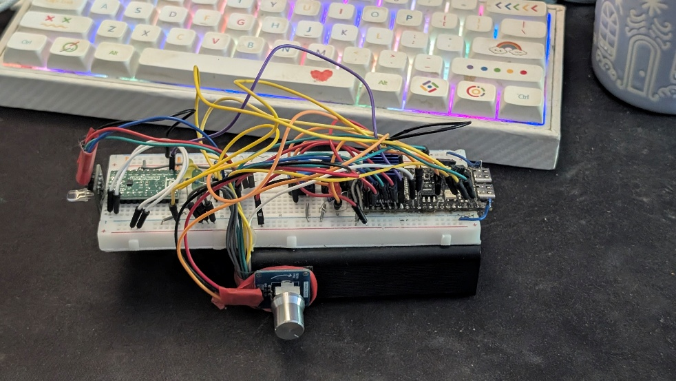
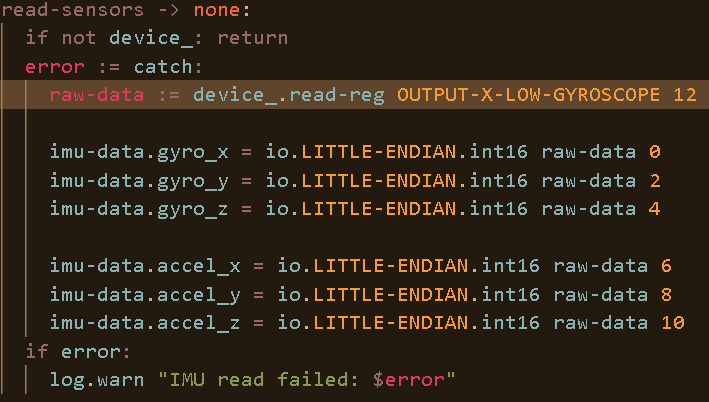
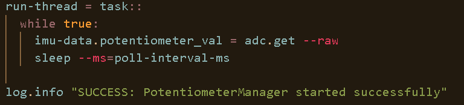
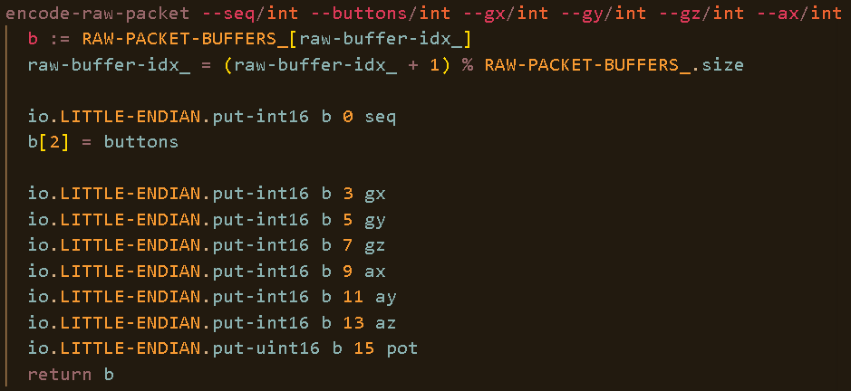
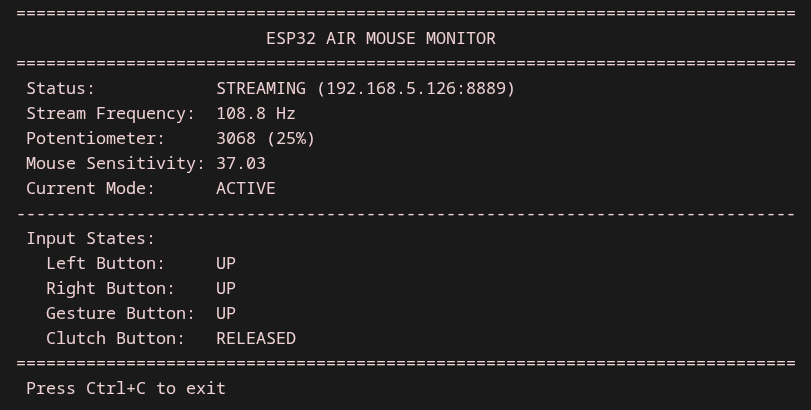

# ESP32-S3 AirMouse - Poročilo

---

## 1. Uvod

Projekt temelji na IMU senzorju LSM6DSOX, katerega glavna naloga je posredovanje aktualnih podatkov 3-osnega pospeškomera in 3-osnega žiroskopa na ESP32-S3 preko I2C, ki zapakira podatke v paket in ga preko UDP pošlje na računalnik, kjer se v python klientu zgodijo vse »težje« komputacije (filtri, premiki kazalca, itd.). Vse to skupaj se poveže v našo uporabi »air-mouse« napravo, ki brezžično upravlja kazalec z rotacijo in premikanjem roke.

---

## 2. Komponente

- ESP32-S3 razvojna plošča
- 6-osni IMU LSM6DSOX
- 4x Gumb (»sklopka«, levi klik, desni klik, geste)
- 5X LED diode
- RGB-LED dioda
- Analogni potenciometer, za nastavljanje občutljivosti premikov

---

## 3. Sestava

Vezje je priklopljeno po shemi v tabeli:

| Komponenta | Pin / funkcija | GPIO ESP32-S3 |
| :--- | :--- | :--- |
| LSM6DSOX | SDA | GPIO 21 |
| LSM6DSOX | SCL | GPIO 20 |
| LSM6DSOX | INT (data-ready) | GPIO 7 |
| Gumb sklopka | pull-up vhod | GPIO 1 |
| Levi klik | pull-up vhod | GPIO 35 |
| Desni klik | pull-up vhod | GPIO 16 |
| Gumb za gesto | pull-up vhod | GPIO 3 |
| Potenciometer | ADC1 | GPIO 2 |
| LED levi/desni klik | izhod | GPIO 14 / 11 |
| LED pan / zaklep osi | izhod | GPIO 40 / 13 |
| Overload LED | izhod | GPIO 17 |
| RGB LED (R/G/B) | izhod | GPIO 6 / 5 / 4 |

Na ESP32 so povezani vsi moduli (gumbi, LED diode, IMU, ...). Sama naprava je povezana na breadboard-u, za napajanje pa poskrbi prenosna baterija.

---

## 4. Opis delovanja

Naprava je razdeljena na dva dela: ESP32-S3 skrbi za zajem podatkov in prenos, Python program na odjemalcu pa za obdelavo in premikanje kazalca.

### 4.1 Zajem in prenos podatkov (ESP32-S3)

LSM6DSOX vzorči žiroskop in pospeškomer s frekvenco 208 Hz. Ob vsakem novem vzorcu senzor na pin INT1 pošlje kratek pulz, na katerega se ESP32-S3 odzove z enim samim branjem vseh 12 bajtov podatkov prek I²C (3 osi žiroskopa in 3 osi pospeškomerja, po 2 bajta na os).

Za nastavljanje občutljivosti miške skrbi analogni potenciometer, ki ga ESP32-S3 prek ADC vhoda odčita vsakih 50 ms in njegovo vrednost prenaša v vsakem UDP paketu. S tem uporabnik občutljivost prilagaja med samim delom, brez ponovnega zagona ali nastavljanja programske opreme.

Ker so podatki prebrani v enem prenosu, sta oba vzorca časovno usklajena. Program hkrati odšteje odstope žiroskopa, priredi stanja gumbov (4-bitna maska: sklopka, levi klik, desni klik, gesta) in vrednost potenciometra, vse skupaj zapakira v 17-bajtni UDP paket, ter ga pošlje prek Wi-Fi na računalnik.

Vsa Firmware je napisan v jeziku Toit, visokonivojskem jeziku za mikrokrmilnike ESP32. Njegova največja prednost za to nalogo je vgrajena sočasnost, ki poskrbi, da vsak del sistema (vzorčenje IMU, odčitavanje gumbov, potenciometer, Wi-Fi strežnik) teče v svojem »opravilu« brez ročnega upravljanja s prekinitvami ali nitmi. Jezik ima samodejno upravljanje pomnilnika in izjem, kar poenostavi zanesljivo delovanje, če na primer I2C branje ali Wi-Fi povezava odpovesta, napako ujamemo in povezavo ponovno vzpostavimo brez ponovnega zagona naprave. Visokonivosjkost jezika Toit nam tako omogoča hitre iteracije prototipov z novimi funcionalnostmi.

### 4.3 Obdelava podatkov (Python na računalniku)

Program sprejema UDP pakete ESP32 strežnika in jih s pomočjo raznih filtrov in drugih efektov spremeni v odzivne in uporabniku prilagojene premike kazalca.

Da so sami premiki kazalca lepo tekoči (in ne skakajoči), hkrati pa odzivni na uporabnikove premike, skrbita 1-Euro in Madgwickov filter.

Filtrirane vrednosti se s pomočjo rotacijske matrike projicirajo na ravnino 2D zaslona glede na trenutni nagib roke (roll), ki ga določa Madgwickov filter, dobljeni odmik pa se pretvori v premik kazalca.

Ko roka miruje, program sproti prilagaja začetno vrednost žiroskopa, da se napaka zaradi odnašanja(»Gyroscope Drift«) ne kopiči. Drobne tresljaje, ki so pod nastavljeno mejo se ignorira, zato da kazalec na zaslonu pri mirovanju ne »pleše«. Temu pravimo mrtva cona (angl. "deadzone").

### 4.4 Načini delovanja

| Način | Kako ga vklopim | Kaj se zgodi |
| :--- | :--- | :--- |
| premikanje kazalca | privzeto | 1-Euro filter + pospeševalna krivulja pri hitrih potezah |
| repozicioniranje /rekalibriranje | držim sklopko | kazalec se zelo upočasni in se skoraj ne premika, roko lahko prestavim nazaj na kurzor |
| klik(levi/desni) | klik levega ali desnega gumba | zgodi se levi ali desni klik |
| dvojni klik | držim gumb geste + levi klik | zgodi se dvojni levi klik |
| sredinski gumb | držim gumb geste + desni klik | zgodi se sredinski klik |
| pomik po vsebini | držim sklopko + naprava v mirovanju za 100ms | vključi se način pomika po vsebini (vertikalno/horizontalno) |
| nazaj | držim gumb geste + sunek v levo | zgodi se OS dogodek "nazaj" |
| naprej | držim gumb geste + sunek v desno | zgodi se OS dogodek "naprej" |

Slika prikazuje terminal na odjemalčevi strani, ki prikazuje vse aktualne informacije o napravi.

### 4.5 Indikacija stanja z LED diodami

Naprava ima 6 LED diod, ki uporabniku sproti sporočajo stanje sistema. Glavna je RGB dioda, s katero naprava prikazuje stanje povezave Wi-Fi: oranžna med zagonom, modra med čakanjem na odjemalca, zelena, ko je povezava z računalnikom vzpostavljena in rdeča ob napaki. Med gesto za kalibracijo RGB dioda sveti vijolično, po uspešni ponovni kalibraciji pa 5-krat utripne z zeleno barvo.

Poleg tega imamo še 5 enobarvnih LED diod. Te uporabniku sporočajo različne signale. Rdeča ob mikrokontrolerju sporoča visoko zasedenost procesorja, zelena in rumena na koncu daljinca prikazujeta stanje pri načinu drsanja po vsebini. Gumba za levi in desni klik imata vsak svojo LED diodo, ki prikazuje njuno stanje.

*Avtor: Laris Pintar*

---

## 5. Povezave in posnetki:

- [Spletno interaktivno poročilo in dokumentacija (SLO/EN)](https://esp-demo.mairup.space/docs/)
- [Interaktivna demonstracija v brskalniku (Live Demo)](https://esp-demo.mairup.space/)
- [Github repozitorij](https://github.com/mairup/esp32-s3_airmouse)

### Posnetki delovanja:

- **Zagon naprave in Wi-Fi povezava:** [`startup.mp4`](../vids/startup.mp4) — prikaz inicializacije sistema in LED indikatorjev ob povezovanju. 
**(Če ste pozorni, lahko za nekaj sto ms opazite stanje oglaševanja Wi-Fi strežnika, prikazano na RGB LED diodi v modri barvi. V tem času se esp strežnik in računalnik odjemalec sinhronizirata. Takoj za tem, ko RGB LED dioda spremeni barvo v zeleno, je naprava pripravljena na uporabo.)**

- **Kalibracija žiroskopa:** [`calibration.mp4`](../vids/calibration.mp4) — postopek rekalibracije z gesto (vijolična LED in potrditveni zeleni utripi).
- **Prilagajanje občutljivosti (potenciometer):** [`sensitivity-scaling.mp4`](../vids/sensitivity-scaling.mp4) — dinamično prilagajanje hitrosti/občutljivosti kazalca z analognim potenciometrom.
- **Splošna navigacija kazalca:** [`use-example-1.mp4`](../vids/use-example-1.mp4) — osnovno upravljanje kazalca s premiki roke po zaslonu.
- **Upočasnitev kazalca ob kliku:** [`pointer-slowdown-on-click.mp4`](../vids/pointer-slowdown-on-click.mp4) — stabilizacija in zmanjšanje občutljivosti ob pritisku klika za natančno ciljanje.
- **Stabilizacija klika na prostem območju:** [`pointer-slowdown-on-click-free-area.mp4`](../vids/pointer-slowdown-on-click-free-area.mp4) — demonstracija mirovanja kazalca med zaporednimi kliki na prazni površini.
- **Dvojni klik:** [`double-click.mp4`](../vids/double-click.mp4) — izvedba dvojnega klika s hkratnim držanjem gumba za gesto in levega klika.
- **Vlečenje in spuščanje (Drag & Drop):** [`drag-and-drop-tiles.mp4`](../vids/drag-and-drop-tiles.mp4) — prestavljanje elementov z držanjem gumba in premikom roke.
- **Navpični pomik po vsebini (Vertical Scroll):** [`vertical-scroll.mp4`](../vids/vertical-scroll.mp4) — drsanje navzgor in navzdol v načinu pomika.
- **Vodoravni pomik po vsebini (Horizontal Scroll):** [`horizontal-scroll.mp4`](../vids/horizontal-scroll.mp4) — stransko drsanje po širokih vsebinah.
- **Pomik po vsebini z zaklepom osi:** [`area-scroll-with-axis-lock.mp4`](../vids/area-scroll-with-axis-lock.mp4) — 2D pomik z zaklepom primarne smeri gibanja.
- **Navigacija nazaj in naprej:** [`back-and-forward-navigation.mp4`](../vids/back-and-forward-navigation.mp4) — gesti za brskanje nazaj in naprej s sunkom roke v levo ali desno ob pritisku gumba za geste.
